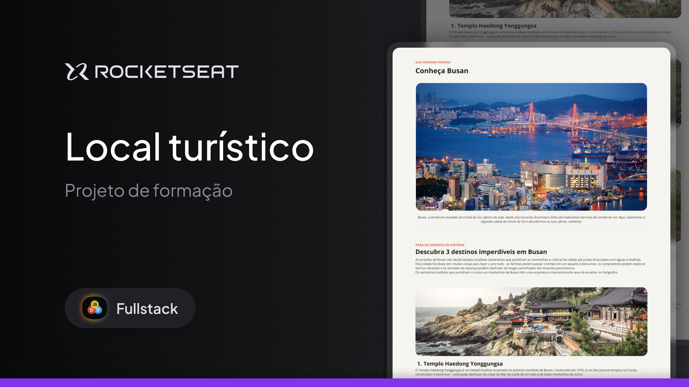

<h1 align="center">🏞️ Busan | Local Turístico</h1>

<p align="center">
  Projeto realizado individualmente como desafio do curso de <strong>Full-Stack da Rocketseat</strong>, utilizando <strong>HTML</strong> e <strong>CSS</strong>.
</p>

<p align="center">
  
</p>

<hr>

## 🎨 Projeto no Figma

Você pode visualizar o layout original do projeto no Figma clicando no link abaixo:

👉 [Acessar o Projeto no Figma](https://www.figma.com/community/file/1384542229391733447/local-turistico)

---

## 🛠️ Tecnologias Utilizadas

- HTML5  
- CSS3

---

## 💡 Aprendizados

Neste desafio individual, desenvolvi minhas habilidades em HTML e CSS ao criar o site sozinho, passei por muitas tentativas e erros, mas no final consegui entregar um resultado satisfatório.

---

## 🚀 Como Executar

1. **Clone o repositório:**
   ```bash
   git clone https://github.com/felipekenjii/projeto-local-turistico.git
